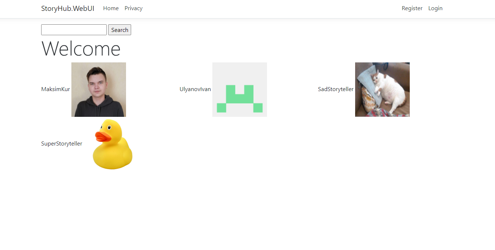
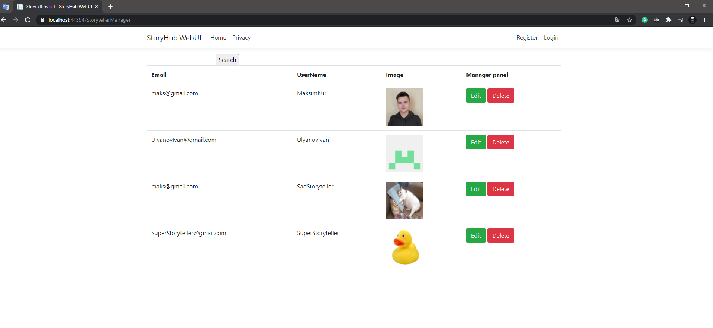
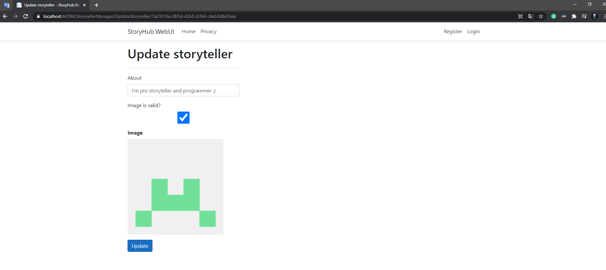

# StoryHub



> StoryHub is a web application where people can read or tell interesting stories from their lives.

## Table of contents
* [General info](#general-info)
* [Technologies](#technologies)
* [How to start](#how-to-start)
* [Features](#features)
* [Status](#status)
* [Special thanks](#special-thanks)
* [Contact](#contact)

## General info
I decided to switch from asp net to asp net core. To make the transition not so difficult, I created a simple web application to familiarize myself with this technology.

## Technologies
* AspNetCore - version 3
* MsTest
* EntityFrameworkCore - version 3.1.10
* Autofac - version 6.1.0
* Bootstrap - version 4

## How to start
* enter in package manager console: ```update-database -Context AppDbContext```
* start project

## Versions
* v1.0.0 - Simple registration of storytellers, with a control panel without a pretty interface.

## Features
* Registration of storytellers.
* Output of all storytellers on the main page.
* Storytellers manager panel. 
* Update panel for storytellers manager. 

## Status
Project is: active work in progress

## Special thanks
You can be first :)

## Contact
Created by maxmamamama2003@gmail.com - feel free to contact me!